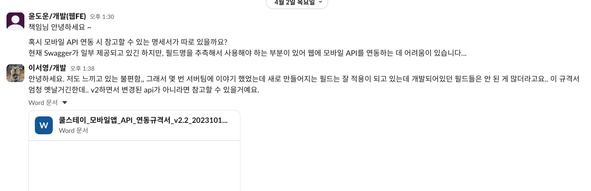

# CoolStay 웹 POC 개발 히스토리

> 기존 모바일 서비스를 웹으로 확장하기 위한 POC 프로젝트.
> AI(Claude Code)를 활용했을 때의 생산성과 한계를 검증하는 것이 목적.

---

## 1. 프로젝트 개요

### 배경

CoolStay는 모바일 앱(AOS/iOS)으로 서비스 중인 숙박 예약 플랫폼이다. 웹 서비스 런칭을 검토하는 과정에서, 기존 모바일 API를 재활용하여 AI 도구로 웹 프론트엔드를 구축하면 어느 정도의 성과가 나오는지 검증하기 위해 POC를 진행했다.

### 핵심 전제 조건

- **API 명세서 부재**: 백엔드 API에 대한 공식 문서가 존재하지 않았다. Java/Spring 백엔드 소스코드와 AOS Kotlin 클라이언트 코드, dev 서버만 있는 상태에서 시작.


- **1인 개발**: 프론트엔드 개발자 1명이 Claude Code(AI)와 협업하여 전체 작업 수행.
- **Claude MAX $100/월 요금제**: Opus 모델 무제한 사용 가능. Pro($20) 요금제 대비 사용량 5배로, 동일 작업을 Pro로 진행할 경우 **기간도 최소 5배 이상 소요**로 추정.

### 종합 수치

| 항목 | 수치 |
|------|------|
| 전체 기간 | 2026-01-19 ~ 2026-04-16 (약 3개월) |
| 실제 작업기간 | **20일** (기획전 고도화, CS인입 등 기존 업무와 병행하여 작업) |
| 작업 투입 시간 합계 | 약 100시간 (20일 × 하루 평균 5시간) |
| 웹 코드량 | 32,669줄 (TSX/TS) |
| 명세서 산출물 | 64,308줄 (51 MD + 139 JSON) — API 명세서가 없는 상태에서 역분석으로 생성한 SSoT |
| 페이지 수 | 36개 — 라우팅 가능한 독립 화면 (홈, 검색, 상세, 예약, 마이페이지 하위 등) |
| 도메인 수 | 25개 — 비즈니스 단위로 분리된 기능 영역 (검색, 예약, 쿠폰, 리뷰, 기획전 등) |
| 분석된 API | 95개 — 백엔드 소스 정적분석 + dev 서버 실측으로 역분석한 엔드포인트 수 (93% 분석, 92% 실측 검증) |
| WBS 기능 구현율 | 116건 중 87건 완료 (75%) — AOS 앱 기능 목록 기준, 웹에서 구현 완료한 비율 |

---

## 2. 개발 타임라인

### Phase 0: 탐색 (1/19, 1일)

> 1월에 임시 프로젝트로 시작하여 하루 만에 UI 스켈레톤을 만들고, 이후 약 2개월간 중단.

**작업 내용**
- Next.js 프로젝트 초기 설정 + Tailwind CSS 디자인 시스템 구축
- 반응형 레이아웃 시스템, 헤더/푸터, 홈 화면, 검색 페이지 UI
- 15커밋, 22,419줄 생성

**이 시점의 상태**
- API 연동 없음, 모든 데이터는 하드코딩
- "AI로 웹 UI를 얼마나 빠르게 만들 수 있는가"에 대한 초기 감을 잡는 단계
- 1/22 Figma 토큰 연동 테스트 후 중단

---

### Phase 1: 본격 POC — 모바일 앱 기반 재구성 (3/20, 1일)

> 2개월 중단 후, 본격적으로 POC를 시작.
> AOS 앱과 coolstay-service-mobile 백엔드 코드를 직접 읽으며 전면 재구성.

**작업 내용 (29커밋, 하루)**
1. **모바일 앱에 없는 기능 전체 제거** — 1월에 만든 웹 전용 UI(Bento 큐레이션, LocalCuration 등)를 삭제하고 모바일 앱 구조에 맞춤
2. **홈 화면 8개 섹션 구성** — HeroSection, BusinessTypeGrid, PromoBannerCarousel, PromoCards, RecentlyViewed, FeatureSection, RegionRecommendations, MagazineSection
3. **검색 페이지 재구성** — v1/v2 검색 페이지를 통합, 모바일 앱과 동일한 SearchConditionBar(날짜/인원/지역) 구현
4. **숙소 상세 페이지 구현** — ImageGallery, RoomCard, ReviewSection, PolicySection 등 전체 구조
5. **V2 API 첫 연동** — 홈 화면 API 클라이언트 + Next.js 프록시 구성
6. **로그인/회원가입 페이지 구현**
7. **작업 히스토리 시스템 도입** — `.work-history/entries/`에 모든 작업 기록, pre-commit hook으로 강제

**의사결정**
- URL 기반 상태 관리 채택 (SEO/공유 가능성)
- 모바일 앱의 API 모델을 그대로 따르기로 결정 (향후 API 전환 비용 최소화)

---

### Phase 2: 도메인별 API 연동 (3/25~3/27, 3일)

> 핵심 도메인의 실제 API 연동에 돌입.

**작업 내용 (57커밋)**

| 날짜 | 주요 작업 |
|------|----------|
| 3/25 | Android 기능 정합 완료 (Phase 1~4, 29개 태스크 머지), 네비게이션 정리 (BottomNav 4탭, 햄버거 제거) |
| 3/26 | 검색 API 연동 (2단계 API 패턴: keyword → list), 숙소 상세 API 연동, 예약 API 연동 (ready/register 플로우) |
| 3/27 | 카드 UI 개선, 마이페이지 서브 도메인 UI 구현 (예약내역, 쿠폰, 마일리지, 알림, 리뷰, 문의, 공지, FAQ, 가이드, 설정, 약관) |

**첫 번째 스펙 불일치 발견 (3/27)**
- 검색 엔드포인트: `contents/list`가 아니라 `search/keyword` → `keyword/list` (2단계)
- `sort=BENEFIT` 파라미터 필수 (없으면 빈 응답)
- 날짜 포맷: `YYYY-MM-DD`가 아니라 `yyyyMMdd`

> 이 시점까지는 "코드를 읽으면 대충 맞겠지"라는 가정으로 진행.
> 불일치가 나올 때마다 하나씩 수정하는 방식.

---

### Phase 3: 인증 연동 + API 불일치 폭발 (3/30~3/31, 2일)

> 인증(Auth) 연동에서 심각한 스펙 불일치를 경험하고, 나머지 도메인에서도 연쇄적으로 문제가 터짐.

**3/30 — 인증 연동의 벽**

로그인 API 호출 시 401 토큰 불일치 에러 발생. 원인 분석에 상당 시간 소요.

```
문제: app-secret-code 헤더에 raw secret을 넣으면 401
원인: AOS 앱의 EncryptUtil.kt + NetworkHeaderUtil.kt 역분석 결과,
      app-secret-code = AES-128-CBC(accessToken + "-" + YYYYMMddHHmmss, secret)
      → 매 요청마다 타임스탬프 기반 암호화된 값을 생성해야 함
해결: Web Crypto API로 AES-128-CBC + PKCS7 + Base64 암호화 구현
```

- 비밀번호도 별도 AES 암호화 필요 (서버 토큰 시크릿 사용)
- 이 정보는 어디에도 문서화되어 있지 않았음 — AOS Kotlin 코드를 직접 읽어서 역추적

**3/31 — "스펙 불일치 폭발의 날" (30개 히스토리 엔트리, 하루 최대)**

나머지 도메인(마이페이지, 쿠폰, 마일리지, 알림, 기획전 등)을 API 전환하면서 문제가 연쇄적으로 발생:

| 불일치 유형 | 구체 사례 |
|------------|----------|
| 타임스탬프 단위 | 밀리초가 아닌 **초 단위** |
| 필드 타입 | BoardItem.key: string → **number** |
| 필드 구조 | link: string → **객체** `{type, sub_type, target, btn_name}` |
| 필드명 | images → **image_urls: string[]** |
| 필드명 | banner_image_url → **badge_image_url / detail_banner_image_url** |
| 코드값 | 쿠폰 discount_type "FIXED" → **"AMOUNT"** |

E2E 테스트에서도 추가 이슈 발견:
- Zustand persist 완료 전 렌더링 → 로그인 상태 false 판정 → 강제 로그아웃
- 예약 목록 데이터 구조 불일치로 렌더링 실패

**이 시점의 핵심 문제 인식**

> "AOS 코드와 백엔드 Java 코드만 보고 추측하는 방식으로는 한계가 있다.
> Java 필드명 ≠ JSON 응답 키 (@JsonNaming 변환), VO에 없는 런타임 필드,
> V1/V2 Enum 값 불일치 등이 너무 많다.
> **코드만 보면 70~80%는 맞지만, 나머지 20~30%의 불일치가 전체 구현을 무너뜨린다.**"

---

### Phase 4: API 응답 기반 전면 재설계 + 전략 전환 (4/1~4/3, 3일)

> dev 서버 실제 응답을 기준으로 타입과 UI를 전면 재설계하면서,
> 근본적으로 **"입력 데이터(API 명세)의 품질을 높이는 것이 핵심"**이라는 판단에 도달.

**4/1 — API 응답 기반 UI 재설계 (Phase 10~12)**

dev 서버 실제 응답을 기준으로 타입과 UI를 전면 재설계:
- 가이드/쿠폰/기획전/찜 4개 도메인 타입 재정의 + UI 재설계
- 숙소 상세/검색 카드/홈/예약/리뷰/마일리지 API 필드 100% 활용 검증
- E2E Playwright 검증 완료
- 총 139 테스트 통과

**4/2~4/3 — 전략 전환 결정**

수동으로 하나씩 API 응답을 확인하고 타입을 수정하는 작업의 반복에서, 근본적 질문이 생김:

> "매번 dev 서버를 찍어보고 타입을 고치는 게 아니라,
> **처음부터 정확한 명세가 있으면 이런 재작업이 필요 없지 않은가?**"

- AOS 코드 + 백엔드 코드를 보고 추측하는 방식의 한계가 명확해짐
- 코드만 보면 70~80%는 맞지만, 나머지 20~30%의 불일치가 전체 구현의 재작업을 유발
- **"코드를 고치는 것"이 아니라 "명세를 만드는 것"이 근본 해결**이라는 결론

→ 4/3, **coolstay-domain-analysis** 프로젝트를 신규 생성하고 체계적인 역분석 파이프라인 구축에 착수.

---

### Phase 5: domain-analysis 3계층 파이프라인 구축 (4/3~4/16)

> **"명세를 만드는 AI"** — API 명세서가 없는 상태에서,
> 서버 코드 + dev 서버 실측 + AOS 클라이언트 코드를 3계층으로 역분석하여
> 단일 참조점(SSoT)을 구축하는 파이프라인.

#### 왜 3계층인가

| 계층 | 역할 | 근거 |
|------|------|------|
| **Layer 1: Analyzer** | 서버 Java 코드 정적 분석 | 엔드포인트, 파라미터, VO 필드, 비즈니스 분기를 코드에서 추출 |
| **Layer 2: Verifier** | dev 서버 실측 검증 | 정적 분석만으로는 70~80%. **Java 필드명 ≠ JSON 키**, VO에 없는 런타임 필드 등 나머지 20~30%를 실측이 잡아냄 |
| **Layer 3: Client Analyzer** | AOS 앱 교차검증 | API를 "실제로 어떻게 쓰는가"를 Kotlin 코드에서 추출. 호출 시퀀스, 파라미터 조합, 필드 사용률, 에러 핸들링 |

```
┌──────────────────────────────────────────────────────────────┐
│                       ORCHESTRATOR                            │
│                  (도메인 선정 + 결과 병합)                       │
└────────┬──────────────────┬──────────────────┬───────────────┘
         │                  │                  │
    ┌────▼─────┐      ┌────▼─────┐      ┌─────▼──────┐
    │ LAYER 1  │      │ LAYER 2  │      │  LAYER 3   │
    │ Analyzer │─────→│ Verifier │─────→│  Client    │
    │(서버 정적)│ 초안 │(실측+수정)│ SSoT │ Analyzer   │
    └──────────┘      └──────────┘      │ (AOS 교차) │
                                        └────────────┘
```

#### Layer 1: Analyzer (정적 분석)

서버 소스코드를 읽기 전용으로 분석하여 API 명세 초안 생성.

- **Controller 계층**: 엔드포인트 경로, HTTP 메서드, 파라미터, @ApiResponse 어노테이션
- **Service 계층**: if/else 분기 전수 조사, throw문 → 에러코드 매핑, 한국어 주석 반드시 확인
- **Conversion 계층**: V1↔V2 변환 매핑 (V2Data2MobileConvService.java)
- **산출물**: `api-spec.json` 초안 + `flow.md` + `nested-objects.md`

#### Layer 2: Verifier (실측 검증)

dev 서버에 실제 API 호출을 수행하고, Layer 1 초안과 diff를 자동 검증.

- `node scripts/verify-diff.mjs {domain}` 으로 자동 diff 검증 (수동 눈 대조 금지)
- 파라미터 조합별 전수 호출 (같은 엔드포인트라도 type/category에 따라 응답 구조가 다름)
- diff 리포트의 **[UNDOC]** (문서에 없는 필드), **[PHANTOM]** (문서에만 있는 필드), **[MISMATCH]** (타입/값 불일치) 전부 해소해야 분석 완료
- **산출물**: `verification/*.json` (117개 실측 JSON) + 수정된 SSoT

Layer 2에서 잡아낸 실제 사례:

| 정적 분석이 놓친 것 | 실측이 잡아낸 방법 |
|-------------------|-----------------|
| `is_first_reserve` (코드) | `first_reserve` (실측) — `is_` 접두사 없음 |
| `subItems` (camelCase) | `sub_items` (snake_case) — @JsonNaming 변환 |
| 쿠폰 `received` 필드 | VO에 없지만 런타임에 추가됨 — 실제 JSON에서 발견 |
| Timestamp 밀리초 추정 | `1749456902` → 초 단위 (변환 유틸 미확인) |
| `KAKAO_PAY` (V1 레거시) | `KAKAOPAY` (V2 Enum) — payments/list에서 직접 확인 |

#### Layer 3: Client Analyzer (AOS 교차검증)

AOS 앱의 Kotlin 코드를 추적하여 API가 실제로 어떻게 사용되는지 검증.

- **추적 경로**: Retrofit Interface → Repository → ViewModel → Screen
- **5단계 분석**: API Surface → 파라미터 조합 → 호출 시퀀스 → 필드 사용률 → 에러 핸들링
- AOS가 사용하지 않는 응답 필드 → `web_priority: SKIP` 후보로 분류
- **산출물**: `client-api-map.json` + `android-usage.md` + `ui-binding.md` 보강

#### 추가: /deep-dive (심층 분석)

복잡한 비즈니스 로직이 있는 도메인에 대해 선택적으로 실행.

- 3 Phase 루프 (Reader → Tracer → Documenter)
- 대상 기준: 100줄+ 메서드, 3단계+ 분기 중첩, 3개+ 외부 서비스 호출
- 완료: 결제 플로우, 취소/환불, 쿠폰 계산, 세션 관리, 친구 추천, 홈 파이프라인 등 **16개 문서 (5,017줄)**

#### 퇴근 후 자율 루프 (Autonomous Loop)

domain-analysis는 토큰 집약적 작업이다. 한 도메인의 3계층 분석을 완료하려면:
- Layer 1: 서버 소스 수천~수만 줄 읽기
- Layer 2: 파라미터 조합별 API 다수 호출 + diff 검증
- Layer 3: AOS Retrofit → Repository → ViewModel → Screen 추적

이 작업을 업무 시간에만 진행하면 토큰 한도와 시간 모두 부족하다.
Claude Code의 **자율 루프(autonomous loop)** 기능을 활용하여, 퇴근 후에도 분석 파이프라인을 계속 실행했다.

```
사용 패턴:
1. 업무 시간: 분석 방향 설정, 결과 검토, SSoT 수정 판단
2. 퇴근 후: /analyze <domain>, /analyze-client <domain> 자율 루프 실행
3. 다음날 출근: 밤 사이 생성된 산출물 검토 → 수정 → 다음 도메인 진행

결과: 7개 도메인 × 3계층 분석을 약 2주 만에 완료 (업무 시간만으로는 수 주 추가 소요 예상)
```

#### 도메인별 표준 산출물 (12종)

하나의 도메인 분석이 완료되면 아래 파일이 생성된다:

| 파일 | 설명 | 생성 계층 |
|------|------|:--------:|
| `api-spec.json` | 엔드포인트 명세 (경로, 필드, 비즈니스 규칙, 에러코드) | L1+L2 |
| `nested-objects.md` | 응답 내 중첩 객체의 필드 전개 | L1+L2 |
| `flow.md` | 비즈니스 플로우 + 웹 전환 판단 | L1 |
| `v1-v2-conversion.md` | V1↔V2 변환 매핑 | L1 |
| `android-usage.md` | Android 화면별 호출 매핑 + 호출 시퀀스 | L3 |
| `ui-binding.md` | 화면별 데이터 바인딩 + 필드 사용률 + 웹 우선순위 | L3 |
| `client-api-map.json` | AOS 교차검증 결과 (엔드포인트 매핑, 필드 사용률) | L3 |
| `verification/*.json` | dev 서버 실측 JSON (파라미터 조합별) | L2 |
| `dependencies.json` | 도메인 간 의존관계 | L1 |
| `related-apis.json` | 다른 도메인 API를 호출하는 경우 | L1 |
| `{topic}-logic.md` | 복잡한 내부 로직 심층 문서 | deep-dive |
| `pricing-formula.md` | 가격 계산 로직 (해당 도메인만) | deep-dive |

#### CLAUDE.md 기반 품질 강제 규칙

domain-analysis 프로젝트의 CLAUDE.md에 아래 규칙을 정의하여, AI가 어떤 세션에서 작업하든 동일한 품질 기준을 유지하도록 강제:

```
핵심 원칙: "실측이 코드를 이긴다. 코드가 문서를 이긴다."

1. STATUS.md 동기화 필수
   - 파일 변경 시 현황판 자동 갱신 (동기화 없이 작업 종료 금지)

2. 실측 검증 규칙 (가장 중요)
   - verify-diff.mjs 자동 검증 필수 (수동 눈 대조 금지)
   - diff 리포트의 [UNDOC], [PHANTOM], [MISMATCH] 전부 해소해야 완료
   - Java 필드명 ≠ JSON 키 (@JsonNaming, @JsonProperty 주의)
   - 파라미터 조합별 전수 호출 (같은 엔드포인트라도 응답 구조가 다를 수 있음)

3. 분석 품질 규칙
   - if/else 분기 전수 조사 (결제수단별, 금액별, 사용자타입별)
   - 한국어 주석 반드시 읽기 (필드의 실제 의미가 주석에 있는 경우 다수)
   - 유틸 클래스 변환 로직 확인 (타임스탬프 단위, 날짜 기준 등)
   - AOS ViewModel의 API 호출 시퀀스를 flow.md와 교차 검증
```

#### 실행 결과

```
서버 분석: ██████████████████░░ 93%  (88/95 API)
실측 검증: ██████████████████░░ 92%  (87/95, 117 JSON)
AOS 교차: ████████████████████ 100% (7/7 도메인)
Deep-dive: ████████████████████ 100% (8/8 토픽, +7 기존)
```

| 도메인 | API 수 | 분석 | 실측 | AOS | 등급 |
|--------|:------:|:----:|:----:|:---:|:----:|
| reservation (예약) | 11 | 11/11 | 10/11 | O | A+ |
| contents (숙소/검색) | 18 | 18/18 | 17/18 | O | A+ |
| auth (인증) | 24 | 24/24 | 18/24 | O | A+ |
| benefit (쿠폰/마일리지) | 10 | 10/10 | 10/10 | O | A+ |
| home (홈) | 4 | 4/4 | 4/4 | O | A+ |
| ai-magazine (매거진) | 8 | 8/8 | 6/8 | O | A+ |
| manage (관리/운영) | 13 | 13/13 | 8/13 | O | B+ |

---

### Phase 6: SSoT 기반 웹 POC 품질 개선 (4/3~4/16)

> domain-analysis가 확립된 후, 웹 POC의 구현 속도와 정확도가 동시에 향상.

**CLAUDE.md에 API 연동 3단계 규칙을 강제 적용:**

```
1. domain-analysis 스펙 확인 (건너뛰기 금지)
   - api-spec.json → 엔드포인트, 파라미터 필수/선택 여부
   - nested-objects.md → 응답 필드 이름, 타입, 위치
   - _shared/enums.md → 코드 값 매핑

2. dev 서버 실측 검증 (curl 또는 Playwright)
   - 스펙과 실제 응답 diff 확인

3. 타입 정의 → 구현
   - 실측 결과 기준으로 TypeScript 타입 작성
   - 스펙과 실측이 다르면 실측을 따르되, 주석으로 차이 기록
```

**주요 개선 작업 (4/3~4/15, 90커밋)**

| 날짜 | 작업 | 성과 |
|------|------|------|
| 4/3 | 검색 API 파라미터 AOS 앱 동작과 정렬 | 빈 결과 반환 버그 해결 |
| 4/6 | Contents 도메인 타입을 SSoT 기준으로 전면 정렬 | ItemObj 인터페이스 신규, 쿠폰/이벤트/혜택 타입 배열로 수정, 리뷰 코드 수정 (ST301→SR001) |
| 4/6 | Contents UI 갭 구현 + Home 타입 정렬 | benefit_tags, grade_tags, v2_support_flag 뱃지, 쿠폰 할인 금액 표시 |
| 4/7 | 검색 UI 재설계 + 자동완성 API 연동 | 3섹션 자동완성 (키워드/지역/숙소), 압축 해제 로직 (Base64→ZIP→JSON) |
| 4/8 | 기획전 상세 API board_type 수정, 패키지형 기획전 구현 | API 파라미터 정확도 향상 |
| 4/9 | 업태→지역→검색 플로우, 날짜/인원 재조회 구현 | AOS 앱과 동일한 UX 플로우 달성 |
| 4/13 | 정적 빌드(SPA) + dev 서버 배포 | `serve.js` SPA 폴백 서버, `/web/coolstay` basePath |
| 4/14 | 하드코딩 gray-* → 시맨틱 토큰, 글래스모피즘 디자인 통일 | 21개 파일 디자인 토큰 전환 |
| 4/15 | 회원가입 API 버그 수정, 찜하기 로그인 체크, z-index 통일 | 잔여 이슈 정리 |

**domain-analysis 도입 전 vs 후 비교**

| 항목 | 도입 전 (3/20~4/2) | 도입 후 (4/3~4/15) |
|------|:---------------:|:---------------:|
| API 연동 방식 | AOS/백엔드 코드 추측 → 실패 시 수정 | SSoT 스펙 확인 → 실측 → 구현 |
| 스펙 불일치 대응 | 런타임에 발견, 개별 hotfix | 사전 발견, 체계적 정렬 |
| 커밋 유형 | fix 비율 높음 (시행착오) | feat/refactor 비율 높음 (계획적) |
| 도메인 커버리지 | 핵심 6개 도메인 | 25개 도메인 전체 |

---

## 3. 하네스 구조

### 웹 POC 프로젝트 하네스

AI가 코드를 생성할 때 일관된 품질을 유지하도록 프로젝트에 설정한 규칙과 도구 체계.

```
CLAUDE.md (프로젝트 규칙 — 모든 AI 세션에서 자동 로드)
├── 디렉토리 구조 규칙 (도메인 기반 분리)
├── API 연동 3단계 강제 규칙
│   └ 1. domain-analysis 스펙 확인 (건너뛰기 금지)
│   └ 2. dev 서버 실측 검증
│   └ 3. 실측 기준 타입 정의 → 구현
├── TDD 사이클 강제 (Red → Green → 기록)
├── 커밋/브랜치/히스토리 엔트리 컨벤션
└── Mock 데이터 원칙 (API 교체 가능 구조)

.work-history/ (217건 — 컨텍스트 유실 방지)
├── entries/YYYY-MM-DD_HH-MM_<ID>_<slug>.md
└── 모든 작업의 변경 파일, 의사결정 근거, 테스트 결과 기록
    → AI 세션이 끊겨도 이전 작업의 맥락을 복원 가능

scripts/ (자동화)
├── task-status.sh (TASKS.md 진행률 추적)
├── pre-commit hook (히스토리 엔트리 존재 확인)
└── post-commit hook (진행률 자동 갱신)
```

### domain-analysis 하네스

API 명세를 역분석하는 AI 전용 프로젝트. CLAUDE.md에 분석 파이프라인 규칙과 스킬(슬래시 커맨드)을 정의.

```
CLAUDE.md (분석 규칙)
├── 프로젝트 구조 + 도메인 폴더 표준 구성 (12종 파일)
├── 3계층 파이프라인 정의
│   ├── /analyze <domain> — Layer 1+2 (정적분석 → 실측검증)
│   ├── /analyze-client <domain> — Layer 3 (AOS 교차검증, 5단계)
│   └── /deep-dive <domain> <topic> — 심층 분석 (3 Phase 루프)
├── 강제 규칙
│   ├── STATUS.md 동기화 필수 (파일 변경 시 현황판 자동 갱신)
│   ├── verify-diff.mjs 실행 필수 (수동 눈 대조 금지)
│   └── 실측이 코드를 이긴다. 코드가 문서를 이긴다.
├── 원천 시스템 경로 (백엔드/AOS/dev 서버)
└── 분석 품질 규칙
    ├── Java 필드명 ≠ JSON 키 (@JsonNaming 주의)
    ├── if/else 분기 전수 조사
    ├── 한국어 주석 반드시 읽기
    └── 유틸 클래스 변환 로직 확인

scripts/
├── api-verifier.mjs (API 실측 호출 + JSON 저장)
└── verify-diff.mjs (초안 vs 실측 자동 diff)

STATUS.md (현황판 — 전체 진행률 실시간 추적)
├── 도메인별 분석/실측/AOS/등급 현황
└── 전체 API 목록 + 개별 검증 상태
```

### coolstay-docs (사내 공유용 문서 — 별도 프로젝트)

2월부터 운영 중인 Vite 기반 문서 사이트. 4/6에 domain-analysis 결과를 연동하여 사람이 읽을 수 있는 형태로 변환.

- 154개 콘텐츠 파일 (CMS/PMS 권한, 정책, 기획서 링크, API 명세)
- domain-analysis가 AI용 SSoT라면, coolstay-docs는 **사내 공유용 SSoT**

---

## 4. 산출물 정리

이 POC의 산출물은 웹 프로토타입 하나가 아니라 **3개**다.

| 산출물 | 규모 | 가치 |
|--------|------|------|
| **coolstay-web-nextjs** (웹 POC) | 32,669줄, 36페이지, 25도메인 | 웹 런칭 의사결정 근거 + 본 프로젝트 스펙/프로토타입 |
| **coolstay-domain-analysis** (AI용 명세서) | 64,308줄, 95개 API 분석 | 지금까지 없던 API 명세가 체계적으로 정리됨. 향후 어떤 클라이언트(웹/앱) 개발에서든 재활용 가능 |
| **coolstay-docs** (사내 공유 문서) | 154개 콘텐츠 파일 | 팀 내 도메인 지식 공유. 신규 인력 온보딩 자료 |

---

## 5. AI 활용 분석

### AI가 효과적이었던 영역

| 영역 | 구체 사례 |
|------|----------|
| **반복적 UI 구현** | 25개 도메인의 리스트/상세/폼 페이지를 일관된 패턴으로 빠르게 생성 |
| **타입 생성** | api-spec.json → TypeScript 인터페이스 자동 변환 |
| **API 연동 보일러플레이트** | React Query hooks, API 클라이언트 함수, 에러 핸들링 패턴 |
| **역분석 파이프라인** | Java/Kotlin 소스를 읽고 구조화된 명세서로 변환 (사람이 하면 수 주 소요) |
| **실측 검증 자동화** | 파라미터 조합별 API 호출 + diff 검증을 체계적으로 수행 |
| **리팩토링** | 디자인 토큰 전환, 시맨틱 컬러 통일 등 기계적 변경 |

### AI가 한계를 보인 영역

| 영역 | 구체 사례 |
|------|----------|
| **디자인 판단** | 디자인 레퍼런스 없이 기존 패턴을 답습하는 경향. 시각적 품질은 사람의 판단이 필수 |
| **비즈니스 분기 대응** | 현장결제/카드결제 분기, 취소 정책 적용 등 도메인 지식 필요한 판단 |
| **API 스펙 불일치 대응** | 실측 없이 코드만 보면 70~80% 정확도 한계 → 반드시 실측 검증 필요 |
| **SDK 연동** | Kakao/Naver OAuth, Naver Map 임베디드, NICE 본인인증 등 외부 SDK는 AI로 완성 불가 |

### 핵심 교훈

> **AI에게 "코드를 고쳐라"보다 "명세를 만들어라"가 훨씬 효과적이다.**

Phase 3까지는 API 불일치가 나올 때마다 코드를 수정하는 방식이었다. 하지만 이건 끝이 없었다.
domain-analysis 파이프라인을 만들어서 **입력의 품질을 높이자**, 출력(웹 POC)의 품질이 동반 상승했다.

- 명세 없이 코드 추측 → 구현 → 불일치 발견 → 수정: **재작업의 악순환**
- 3계층 역분석 → 정확한 명세 → 구현: **한 번에 맞는 구현**

AI의 가장 큰 가치는 "코드를 대신 짜주는 것"이 아니라,
**"사람이 수동으로 하면 수 주 걸리는 역분석/문서화를 체계적으로 수행하는 것"**이었다.
64,308줄의 명세서를 사람이 직접 작성했다면 수 주가 걸렸을 작업을, AI가 퇴근 후 자율 루프까지 활용하여 약 2주 만에 완료했다.

---

## 6. 비용 관점

### Claude MAX ($100/월) 기준

- Opus 모델 5시간 토큰 제한 존재
- domain-analysis 3계층 파이프라인: Layer별 대량 토큰 소모
  - Layer 1: Java/Kotlin 소스 수만 줄 읽기
  - Layer 2: 117회 API 실측 + diff 검증
  - Layer 3: AOS 65개 ViewModel 추적
  - deep-dive: 16개 심층 문서 생성
- **퇴근 후 자율 루프로 야간 작업 병행**: 업무 시간에 방향을 설정하고, 퇴근 후 분석 파이프라인을 자율 루프로 실행하여 토큰을 집중 소모. 이를 통해 7개 도메인 분석을 2주 만에 완료.

### 하위 요금제 (Pro $20/월)로 진행할 경우

Claude 공식 기준 MAX는 Pro 대비 사용량 5배. 동일 작업을 Pro로 진행하면:

- **일일 토큰 한도**로 작업이 빈번하게 중단됨
- domain-analysis 단독으로도 수 주 소요 추정
- 하루에 처리할 수 있는 분석량이 제한되어 **전체 기간 최소 5배 이상 소요 예상**
- 퇴근 후 자율 루프도 토큰 한도 내에서만 가능 → 야간 병행 작업의 효과 대폭 감소
- 결과적으로 20일 → **3개월 이상**으로 확대

---

## 7. 향후 과제 — 프로덕션까지의 갭

이 POC에서 확인되지 않은, 본 프로젝트에서 추가로 필요한 영역:

| 카테고리 | 미구현 항목 |
|----------|-----------|
| **인증** | 소셜 로그인 SDK 연동 (카카오/네이버/애플), 신규회원 설문조사 |
| **외부 연동** | 토스 PG, 네이버 지도 임베디드, NICE 본인인증, Google Analytics |
| **UI/UX** | 홈 팝업/플로팅 버튼, 비회원 메뉴/예약조회, 친구 추천 |
| **품질** | 성능 최적화 (SSR/ISR), 접근성(a11y), SEO, 에러 핸들링 고도화, QA |
| **인프라** | CI/CD 파이프라인, 모니터링, 로깅, 스테이징 환경 |
